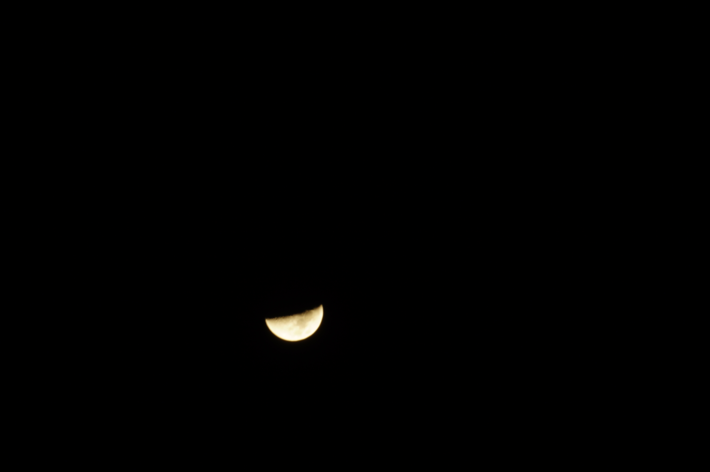
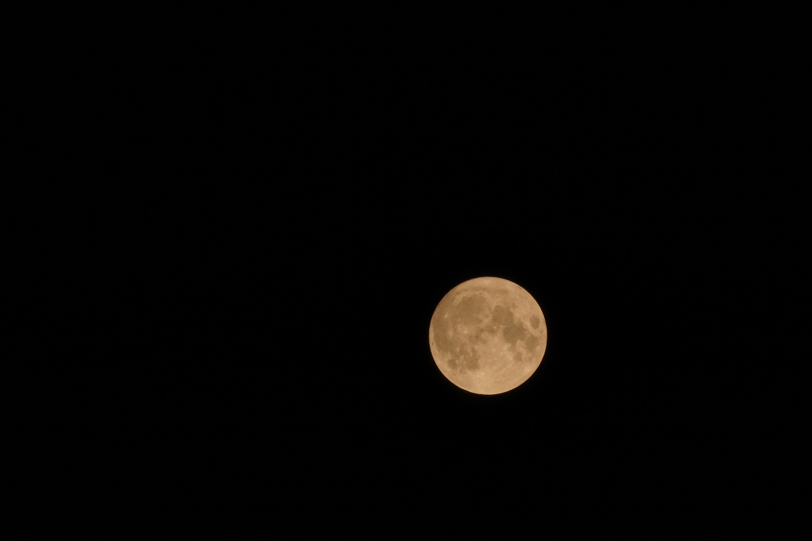
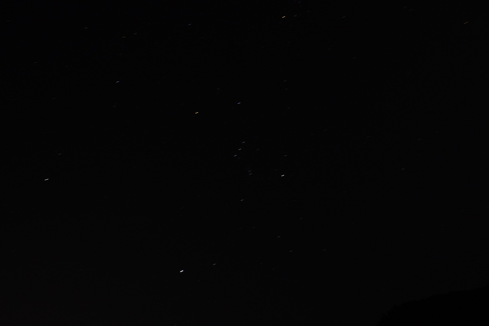

先日，田舎に行く機会がありまして，そこで天体観測をしてみました！天体写真というのは，カメラと三脚があれば撮れるとはいっても，意外と調節が難しいんですねぇ．まあ，そんな中頑張っていろいろ撮ってきたので，ぜひ見てってください！  

<!--more-->

## 場所
細かいことは書きませんが，和歌山県とだけ書いておきます．自分が住んでる所は夜も明るいので，なかなか星が見えませんから，こういう風にしっかりと星が見える場所があると嬉しいもんですね．  
*星が欲しい*

## 何したん？
写真を撮りに行きました！  
当時は月が出ていましたから，とりあえずその写真を撮ったんですが，たとえばこんな感じです．  
  
何ででしょうね？ちょっとピンボケしちゃってるのが残念です．（ちなみにこの写真は焦点距離210mm，ISO感度が100，露出時間2秒，F32です．）ところで，この月は半月ぐらいの写りですが，もっと昔に撮った満月の写真もありまして，そっちはこういう感じなんですねぇ．（ピンボケしてなかったので載せてみました）  
  
こっちは綺麗に写ってます．何でなんか分からへんのですけど，前の写真はただのピンボケなんですかね？  

ところで，天体観測に行ったその時は，冬でしたから，オリオン座とかがよく見えるんですね．冬の星座の代表，みたいな感じで，真ん中の三つ星（オリオンのベルトに当たる部分に，3つ星が並んで見える）が印象的です．  
  
ちょっと暗かったかもしれませんけど，こうして見ると，星ごとに色が違うっていうのがよく分かりますねぇ．ちなみに古い星ほど赤っぽくなるそうです．  

## スター・トレイル
「スター・トレイル」というのは，カメラのシャッターをずっと開けておくことで，星の軌跡を線のように写す，天体写真の撮り方のことなんですねぇ．今回は，自分もこういうのを撮ってみましたので，ぜひご覧ください！  
  
たぶん15分ぐらいなんですけど，よく撮れてると思いませんか？  

## 終わりに
こういう天体写真も綺麗で良いですけど，やっぱり本物の星の方がずっと良いと思うんです．皆さんも，時々空を見上げてみてくださいね．