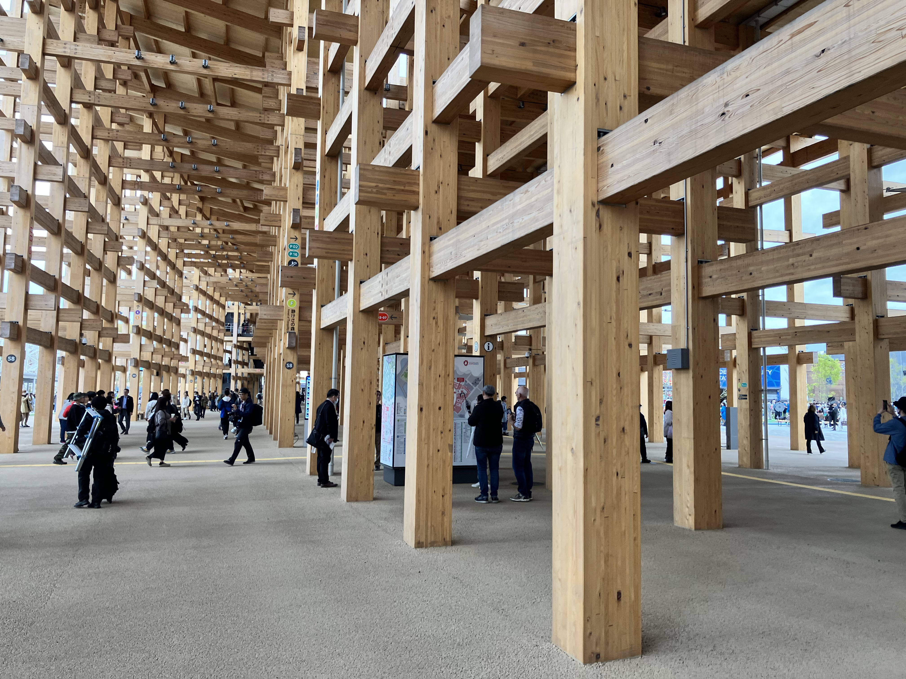
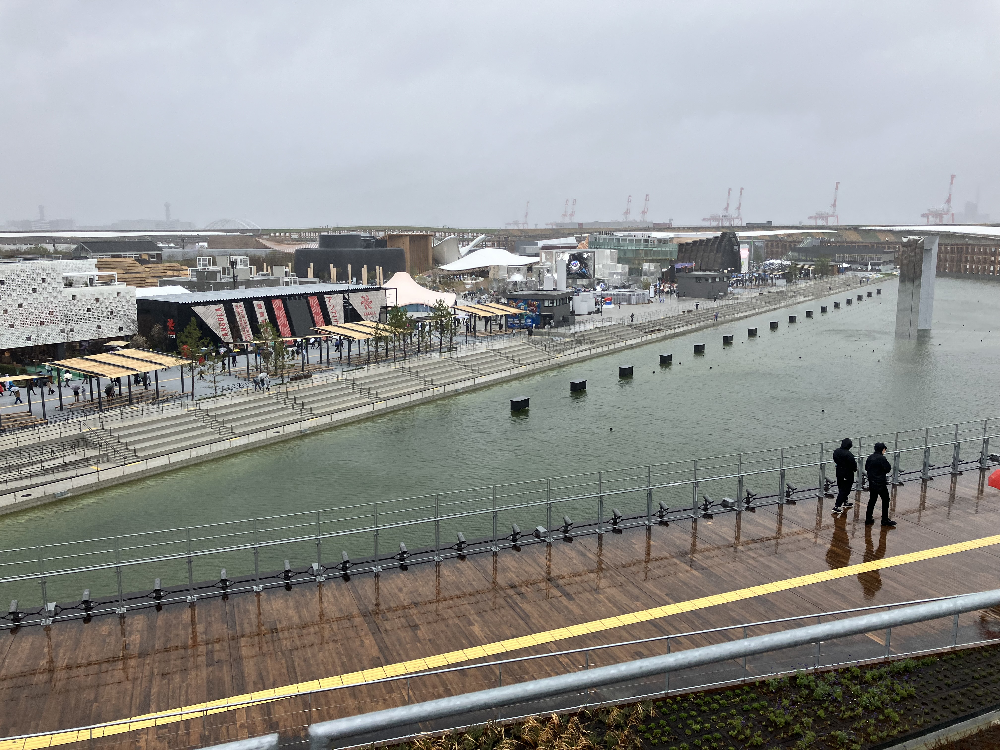
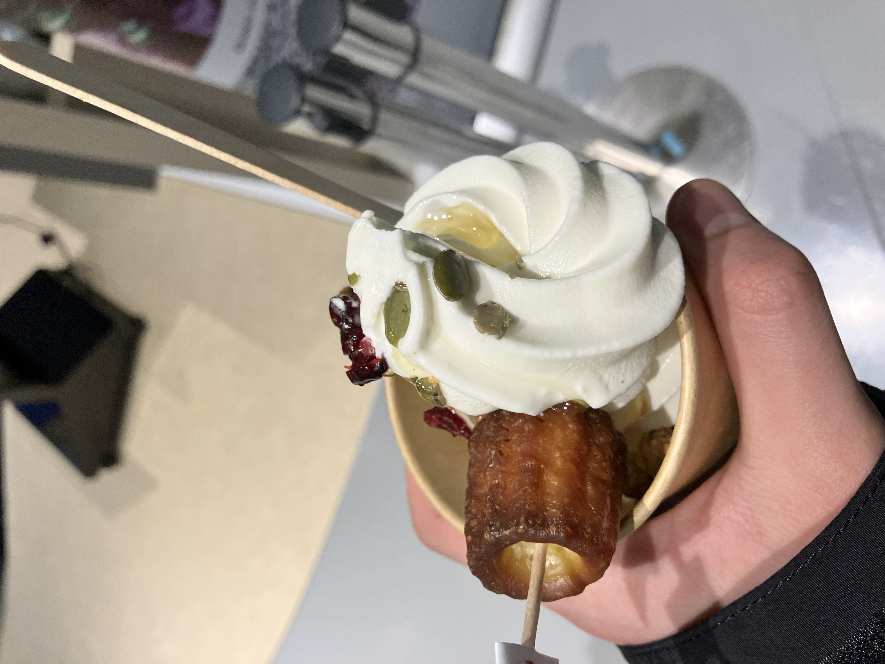
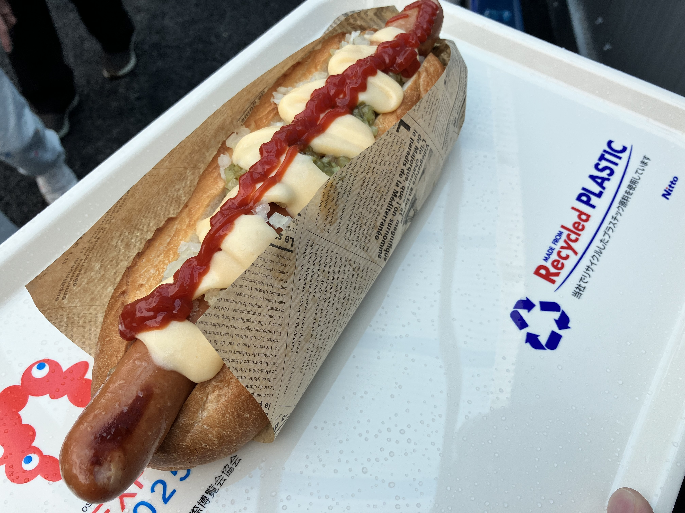

大阪万博が嬉しくて一人で盛り上がっている次第です．開幕初日で，めっちゃ混んでましたけど，自分は思ってたよりは並ばんで済みました！  
今日は，曇りというか，雨みたいな天気やったんで，途中からめっちゃ寒くなってん．海沿いやからか，えらい風も強かったけど，よかったで〜．

<!--more-->

### まずは話題の大屋根リング

下に行って見ましたけど，こんな感じやで！  
  
ちなみに屋根の上に行ったら，こんな感じ！  
  
パノラマもあるでぇ！  
  

### パビリオンは？

パビリオンの予約とかは，一杯でできひんかったけど，予約なしで入れるとこに飛び込んできました．  
たとえば「ブルンジ共和国」っていう，アフリカの展示があったんですけど，そこのハチミツを使ったカフェがあって，これがまたうまかったの．商品開発とかは吹田かどっかのパン屋（？）がやってるらしく，コラボしたみたいな感じなんかな？　　
  
また食べもんになってまうけど，なんか超巨大ホットドッグがあったんで，食べてきたで！（一瞬で腹いっぱいになった．）見つけたら食べて見てな！  
  

万博特集，次回もお楽しみに！