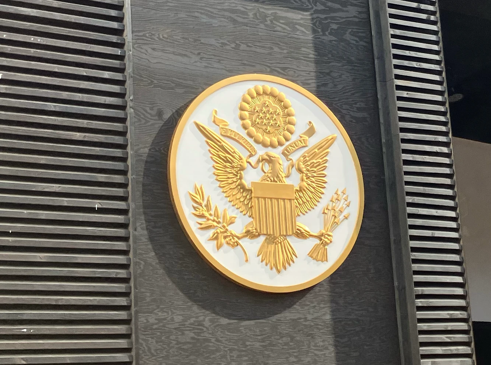

今日は，友人に誘われたので，５回目ですが万博に行ってきました．学校ではテスト最終日ってことで，折角平日やけども早よ帰れるから，万博行ったら空いてるんちゃうか考えてたんやけど...  

<!--more-->

### ぶっちゃけ混んでました！
どれくらいか言うたら，大屋根リングの下に大量にあるはずのベンチに座られへんぐらい，言い方を変えたら，お土産ショップの中では身動きがとられへんぐらい．平日やけど多いなぁ〜．

### どこ行ってん？
今日は珍しく，アメリカ館だけです．ただ，今日は珍しく，アメリカ館のために１時間も並んだでぇ〜（この忍耐強さを褒めて欲しい）  
ちなみに，アメリカ館がたった１時間待ちなのは，大チャンスだそうです．  
パビリオンの外観はこんな感じ！  
  
このマークなんでしょうね．知ってる人いたら連絡ください．  
  

###　月の石
70年万博にもあったようですが（僕は見たことないです），月の石がまた展示されていました．  
すごいなとは思いますが，もし神崎川のほとりで拾ってきた石ころが追いあっても，見分けつかへんなと思いました．（疑ってるわけではないですよ！）  
ピンぼけしてるんで，すんません．
  
もうちょっとじっくり見せてくれ〜．  

### レストランは？
すごいメニュー名がカッコいいんで，気になって入って見ました．中身はフライドポテトとか，オニオンリングフライとか，そんなんやったんですがね．ただ，ソースが日本ではあんまりない感じの，ちょっと酸っぱいお酢みたいな感じで，気に入りました．  
名物とかいうバーガーが売り切れてたのは残念でした．（レストランだけやったら並ばんでええっぽいで）