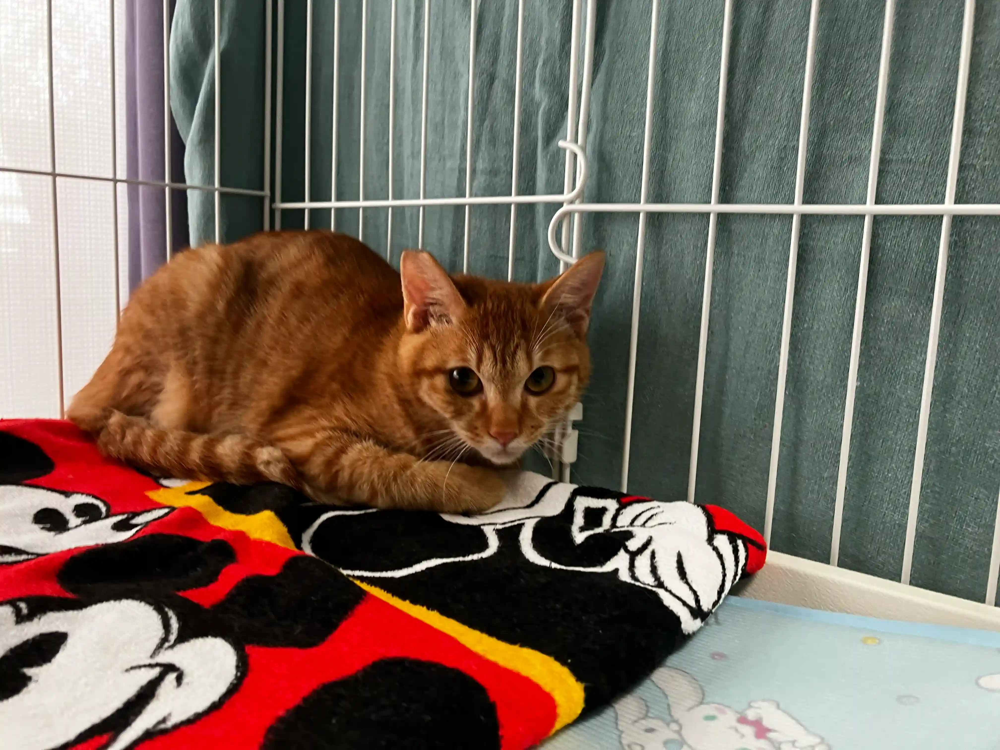
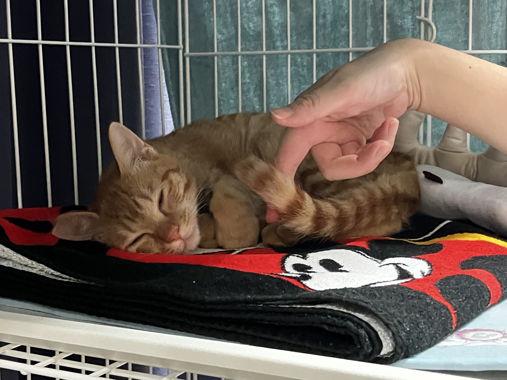
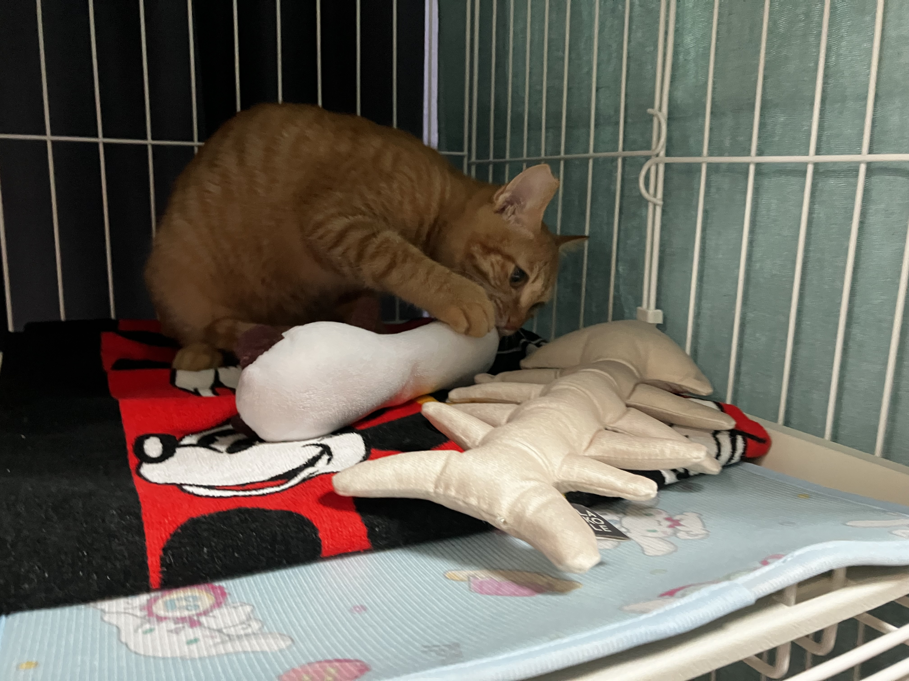

こんばんは，Wingです．先日，このブログの投稿時間を若干ごまかしてるんじゃないかという指摘がありましたが，それは許してください． 
さて，先日，[おおさかねこネット](https://ameblo.jp/osaka-neko-net/)様とお話しして，保護猫のリッチーくんをうちで飼う予定なのですが，今日からトライアルに入ったんですねぇ．非常に可愛い猫さんです．

<!--more-->

### 保護猫を引き取るってどんな感じなん？
トライアルが終わって落ち着いてから，ちゃんとまとめて書きます．しばしお待ちを．
###　どんな猫さんが来たん？
模様は茶虎って感じなんかな？写真見た方がわかりやすいと思うんで、どうぞ． 
 
ビビってだいぶ端っこで固まってますね．可愛い！
びびると言えば，たまにこんなふうに縦になってることがあります．

けどねぇ，これでも今日のうちに，撫でると喜ぶようになりました！

おもちゃで遊ぶ様子も．

今後も猫ちゃんの記事は上げていくつもりです．よろしく！