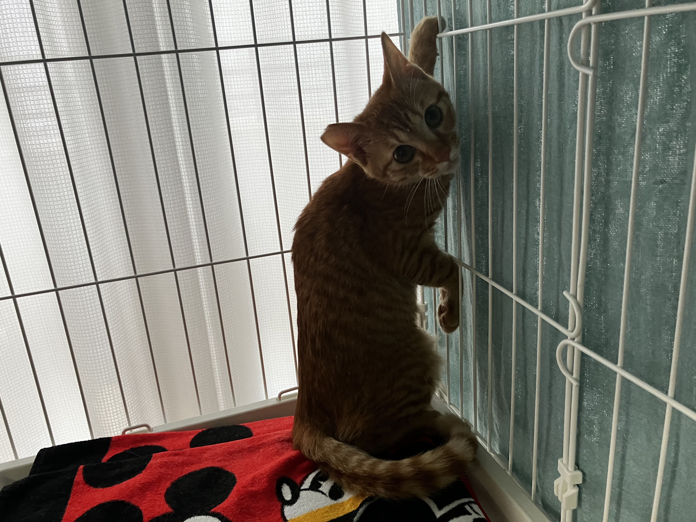
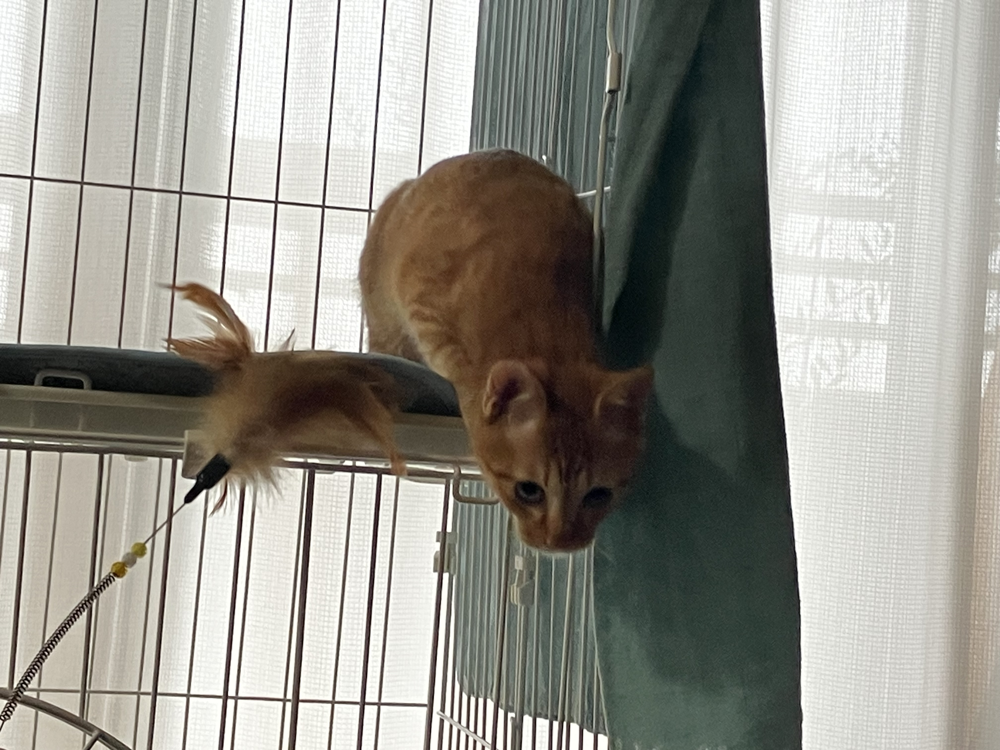
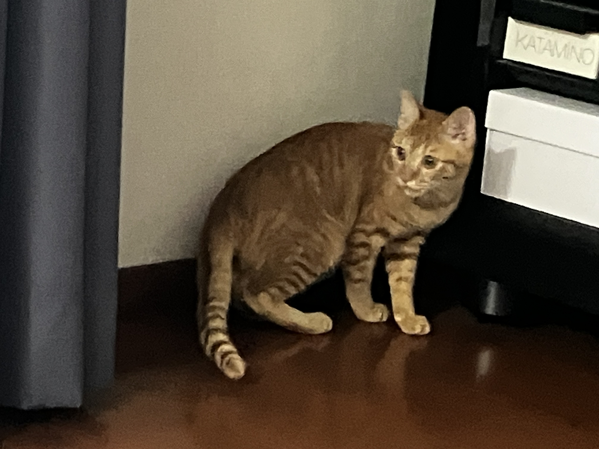

こんばんは，Wingです．  
今日も，リッチーの様子を記録しとこうと思います．

### おはよう
昨日ちょっと慣れてきたんかな〜って感じの様子に見えたんで，今朝いきなり「シャ〜！！」て言われた時はショックでした...  
けど，その後も，物音の一つにめっちゃビビったりしてたんで，超ビビりなんやろな．

その後．お昼ぐらいに，落ち着いた感じになった時は，こんなふうに，部屋の端っこでちょこんと座ってたりしました．香箱座りってやつかな？

ちなみに，猫って，環境の変化に弱く，うちに来てしばらくはケージの中で入れとくことが一般的なんやけど，リッチーはもうすっかりケージの中を自分の家みたいに思ってはるのか，すごいリラックスしてはる様子も見れました！ 
それと対照的に，といっていいのかどうかわかりませんが，今日初めてケージの外に出てみる時は，けっこうビビってましたね．この「出て大丈夫かな？」みたいな表情がたまらん！

やっぱりビビリやねって感じなんか，ケージの外に出ても，壁際に貼り付いたり，テレビの横の隙間に入ったり，ソファの下に潜り込んだりして，大変でしたね．まあ，そうはいっても，（リビングの中だけですが）歩きまわったりもしたので，２日目にしては慣れた方なんちゃうかなと思います．

おもちゃで遊ぶとめっちゃ元気になったよぉ．
